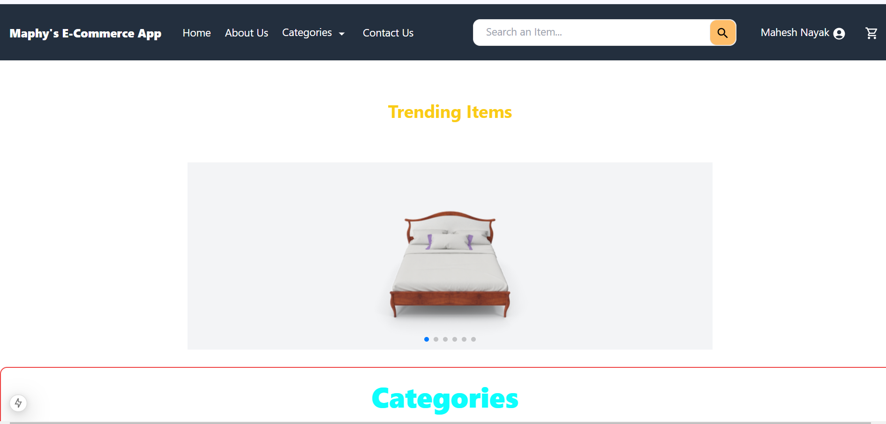
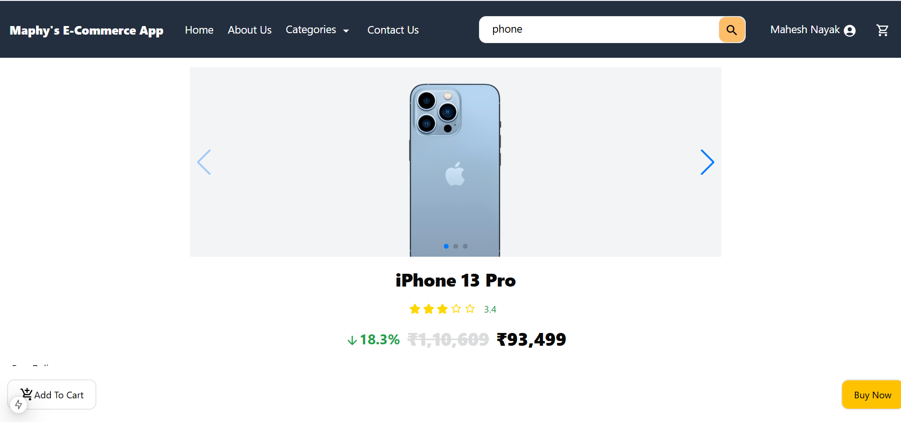
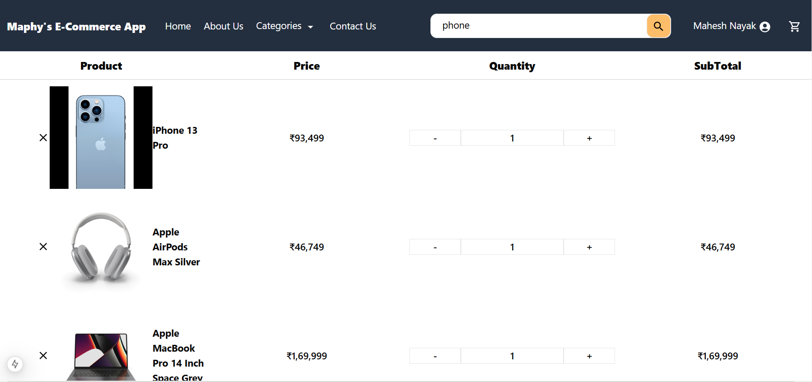
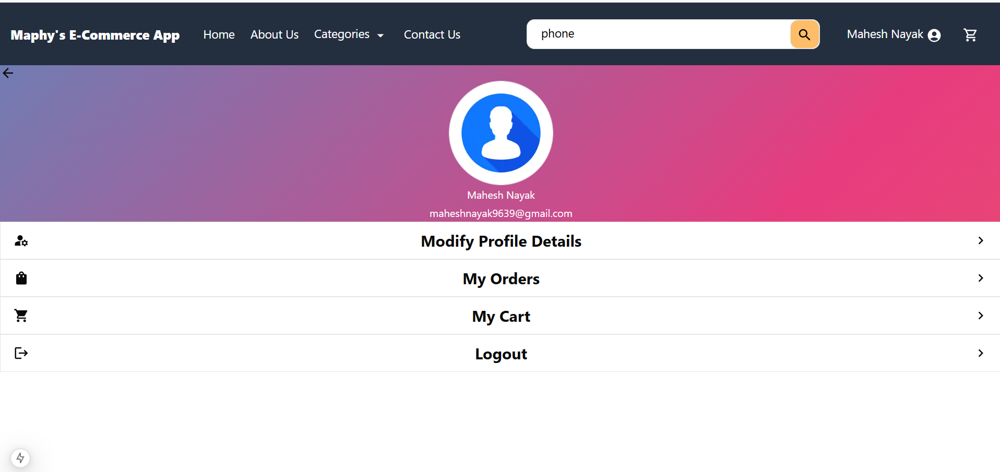

# E-Commerce Website

Welcome to the E-Commerce Website repository! This is a feature-rich and responsive e-commerce platform built with **Next.js**, leveraging modern web technologies to provide an optimized shopping experience.

---

## Features

- **Product Management:**
  - Dynamic product pages with server-side rendering (SSR).
  - Comprehensive product details, including reviews and ratings.

- **User Authentication:**
  - Secure authentication using JWT (JSON Web Tokens).
  - Integration with social logins (Google, Facebook).

- **Shopping Cart:**
  - Add, update, and remove items.
  - Cart state persistence with localStorage/sessionStorage.

- **Order Management:**
  - Order tracking and history.
  - Payment integration (Stripe, Razorpay).

- **Admin Dashboard:**
  - Product and order management.
  - Analytics and insights.

- **Responsive Design:**
  - Fully optimized for mobile, tablet, and desktop devices.

---

## Tech Stack

### Frontend
- **Next.js:**
  Next.js is a React framework that enables server-side rendering (SSR) and static site generation (SSG). It enhances SEO performance and optimizes the user experience by pre-rendering pages and fetching data during the build process or at runtime.

- **Tailwind CSS:**
  A utility-first CSS framework for creating responsive and aesthetically pleasing user interfaces quickly. Tailwind CSS provides pre-defined classes that eliminate the need for custom CSS, accelerating development.

- **React Query:**
  A powerful library for managing server-state data fetching, caching, and synchronization in React applications. React Query simplifies API interactions and ensures your UI is always in sync with the server.

### Backend
- **Node.js:**
  A JavaScript runtime built on Chrome's V8 engine. Node.js is used to build scalable and high-performance backend applications.

- **Express.js:**
  A lightweight and flexible Node.js framework for building APIs and handling HTTP requests. Express simplifies middleware and routing management, making it ideal for RESTful APIs.

- **MongoDB:**
  A NoSQL database used to store application data. MongoDB's flexible schema allows you to handle dynamic and hierarchical data structures effectively.

- **Mongoose:**
  An Object Data Modeling (ODM) library for MongoDB. Mongoose provides schema validation, data modeling, and query building features for MongoDB, making data manipulation intuitive.

### Authentication
- **NextAuth.js:**
  A complete authentication solution for Next.js applications. NextAuth.js supports multiple authentication providers (e.g., Google, Facebook) and offers secure JWT-based session management.

### Payments
- **Stripe API:**
  A robust and flexible payment processing platform that supports multiple payment methods and currencies. Stripe ensures secure transactions and simplifies payment integration with APIs and SDKs.

- **Razorpay:**
  An alternative payment gateway designed for Indian businesses. Razorpay supports local payment methods, including UPI, wallets, and cards, offering a seamless checkout experience.

---

## Installation

1. **Clone the Repository:**

   ```bash
   git clone https://github.com/your-username/ecommerce-website.git
   cd ecommerce-website
   ```

2. **Install Dependencies:**

   ```bash
   npm install
   # or
   yarn install
   ```

3. **Set Environment Variables:**

   Create a `.env.local` file in the root directory and configure the necessary variables for your application, such as API URLs, database connection strings, JWT secrets, and payment gateway keys.

4. **Run the Development Server:**

   ```bash
   npm run dev
   ```

   Open [http://localhost:3000](http://localhost:3000) to view it in the browser.

5. **Run the Backend (if applicable):**

   Navigate to the `backend` directory and start the server:

   ```bash
   cd backend
   npm start
   ```

---

## Usage

- **Home Page:** Displays featured products and categories.
- **Product Page:** Detailed product information with add-to-cart functionality.
- **Cart Page:** Modify cart items and proceed to checkout.
- **Checkout Page:** Complete the payment and place the order.
- **Admin Panel:** Manage products and orders.

---

## Screenshots

| Home Page | Product Page |
|-----------|--------------|
|  |  |

| Cart Page | Admin Dashboard |
|-----------|------------------|
|  |  |

---

## Contributing

Contributions are welcome! Here's how you can help:

1. Fork the repository.
2. Create a feature branch: `git checkout -b feature-name`.
3. Commit your changes: `git commit -m 'Add some feature'`.
4. Push to the branch: `git push origin feature-name`.
5. Submit a pull request.

---

## Contact

Feel free to reach out for any queries:

- **Name:** Mahesh Nayak
- **Email:** [merndeveloper.mahesh@gmail.com](mailto:merndeveloper.mahesh@gmail.com)
- **Portfolio:** [Your Portfolio Link](#)
